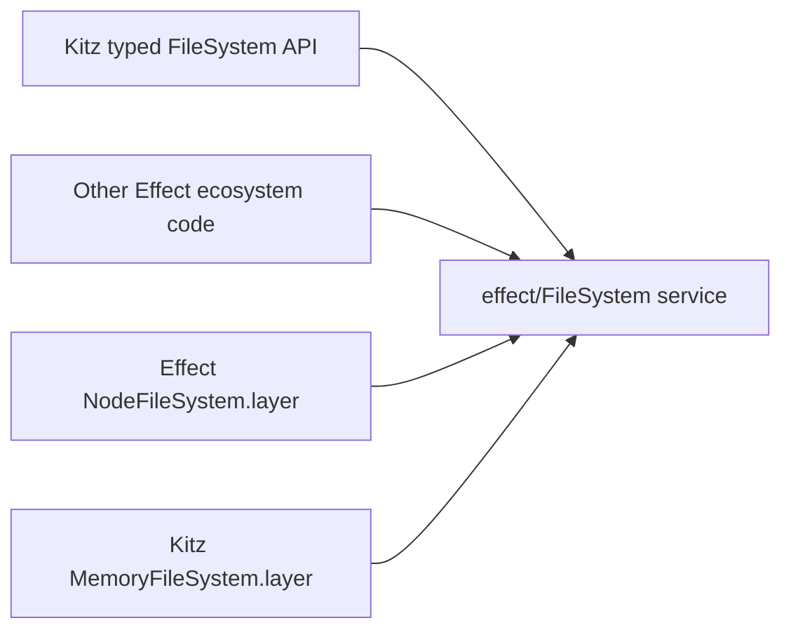

# FileSystem first-principles design — one Effect capability, typed paths everywhere

Date: 2026-07-12
Status: PROPOSED FINAL ARCHITECTURE
Authority: supersedes the 2026-07-11 namespace draft and salvage-led restoration plan.

## Outcome

`@kitz/effect/FileSystem` is the only filesystem API domain code imports.
It replaces direct use of both `node:fs` and `effect/FileSystem` while retaining
Effect's exact `FileSystem` service as the sole runtime capability.
The locked algebra makes this a Node-on-POSIX surface; a Windows backend requires
a separate Windows path algebra rather than string adaptation behind these types.

Kitz contributes:

1. a typed-path-native API over that service;
2. Path-grade literal inference and static diagnostics at every path position;
3. filesystem-truth return models for entries, metadata, links, and events;
4. an out-of-box in-memory provider behaviorally equivalent to Effect's official
   Node provider;
5. a typed façade accessor derived from the same Effect service, never a second
   `Context` identity.

```ts
import { Effect } from 'effect'
import { NodeFileSystem } from '@effect/platform-node'
import { FileSystem, MemoryFileSystem } from '@kitz/effect'

const program = Effect.gen(function* () {
  yield* FileSystem.makeDirectory('./cache/', { recursive: true })
  yield* FileSystem.writeString('./cache/state.json', '{"ready":true}')
  return yield* FileSystem.readString('./cache/state.json')
})

const inMemory = program.pipe(
  Effect.provide(
    MemoryFileSystem.layer({
      cwd: '/workspace/',
      entries: [
        MemoryFileSystem.directory('/workspace/'),
        MemoryFileSystem.directory('/workspace/cache/'),
      ],
    }),
  ),
)

const onNode = program.pipe(Effect.provide(NodeFileSystem.layer))
```

Both layers provide the runtime key `effect/platform/FileSystem`. Arbitrary
Effect ecosystem code and Kitz's typed operations therefore observe the same
filesystem instance.



## Evidence locked for this design

- The finalized Path algebra has four tagged leaves (`AbsFile`, `AbsDir`,
  `RelFile`, `RelDir`), the `Abs` / `Rel` / `File` / `Dir` groups, `Any`, and
  component types. Its public surface is
  [`packages/effect/src/path/__.ts`](../../../packages/effect/src/path/__.ts).
- Path's literal parser and target guards are centralized in
  [`core/literal.ts`](../../../packages/effect/src/path/core/literal.ts). They
  reject widened strings and return inline static errors for malformed,
  wrong-kind, and wrong-group literals.
- Path values are typed POSIX lexical normal forms, not proof of existence,
  inode kind, or symlink target identity. Filesystem-aware identity explicitly
  belongs here.
- Installed `effect@4.0.0-beta.97` is byte-identical, for `FileSystem.ts` and
  `PlatformError.ts`, to the official v4 reference checkout at `5946da38` under
  `~/repo-references/effect-v4-references/effect-smol`.
- That Effect interface has 30 methods and one service identity. Its `make`
  derives only `exists`, string read/write, `stream`, and `sink`; a layer must
  supply the other 25 primitives.
- The official Node layer provides the exact Effect service tag and is itself
  built through `effect/FileSystem.make`.

## Architectural laws

### 1. One filesystem capability

The only context service is Effect's existing `FileSystem` tag.

- `FileSystem.Service` is an alias of that exact tag and interface.
- Top-level Kitz operations require `FileSystem.Service` in their environment.
- `FileSystem.service` is an `Effect` that maps the upstream service to a bound,
  typed façade. It is a view, not a tag.
- Effect's `NodeFileSystem.layer` and Kitz's `MemoryFileSystem.layer` both
  provide `FileSystem.Service` directly.

There is no `@kitz/effect/FileSystem` `Context.Service` and no adapter layer that
must be provided in addition to the backing filesystem.

### 2. Typed paths are the only application path currency

Each operation accepts the narrowest applicable Path group:

| Operation intent | Accepted value |
|---|---|
| file content or handle | `Path.File` |
| directory traversal or creation | `Path.Dir` |
| entry-level metadata or mutation | `Path.Any` |
| bare child name | `Path.Segment` or `Path.FileName` |

Dynamic `string` values are decoded at their real boundary through the Path
schemas. They never flow through Kitz's typed operation surface unchecked. The
memory backend still implements Effect's raw string service contract so that
other Effect ecosystem code observes the same filesystem.

The locked Path normalization is part of the filesystem API's address
semantics. A literal such as `a/link/../file` desugars through Path before I/O;
the raw component sequence is not retained as a Node-style traversal program.
Filesystem data that must retain such a sequence, especially a stored symlink
target, uses its own type rather than pretending to be a Path value.

### 3. Every path position obeys literal duality

Every path parameter accepts either a decoded value or a statically known
literal. The law is the same as Path:

```ts
FileSystem.readString('./config.json')
// is the same operation and type as
FileSystem.readString(Path.RelFile.make('./config.json'))
```

The original literal generic is retained long enough to:

- reject a directory literal in a file position;
- reject an absolute/relative mismatch where an operation requires one group;
- correlate binary positions such as file-to-file and directory-to-directory;
- preserve anchoring in directory, glob, and temporary-path results;
- produce the same branded static-error vocabulary as Path.

The overload scaffolding stays local to each operation, following Path's
literal-duality doctrine; only the parser and target guards are shared.

### 4. Native string encoding is centralized and operation-sensitive

Kitz values desugar to Effect's string API immediately before the upstream
call. One private adapter owns the distinction between Path's canonical form
and each syscall operand's semantics. It does not globally strip directory
terminators: POSIX trailing `/` changes final-component and symlink behavior.

| Operand role | Encoding law |
|---|---|
| existing directory subject | preserve directory spelling so the host enforces directory intent |
| file/entry subject | preserve terminal file spelling |
| `lstat` / `readLink` entry itself | address the link entry without accidentally following a directory terminator |
| new destination | emit a creatable entry spelling while its Kitz type carries file/directory intent |
| relative anchors | encode `./` as `.` and `../` as `..` where the host API requires an entry spelling |

Consumer code never calls `.toString()` for filesystem I/O. Each wrapper pins
the encoding policy for every operand, and conformance tests cover directory
symlinks plus existing and non-existing destinations.

### 5. Path intent and filesystem truth remain distinct

A `Path.F  ile` input expresses the caller's intended operation. It cannot prove
that the entry exists or that the host reports a regular file. Operations that
learn entry kind return that knowledge explicitly.

- `stat` follows links.
- `lstat` observes the entry itself.
- `readDirectory` and `glob` return classified entries.
- `realPath` returns an absolute path classified from the resolved target.
- watch and removed-entry paths stay kind-erased because no safe stat may exist.

### 6. Errors stay typed and composable

- Host failures pass through as Effect's `PlatformError` unchanged.
- A host-returned string that cannot become a Kitz path fails with a qualified
  `FileSystem.PathError`; it never defects and never casts.
- Explicit content codecs expose their own decode/encode error.
- Expected memory-backend failures use the same `PlatformError` reason tags as
  Node.

### 7. Content types come from codecs, not extensions

An extension is a naming convention, not proof of bytes on disk. The core
surface is therefore honest:

- `read` / `write` use `Uint8Array`;
- `readString` / `writeString` use text;
- `readWith` / `writeWith` take an explicit `FileSystem.Codec<A, E>`;
- JSON typing comes from `FileSystem.Codec.json(schema)`, not from `.json`.

Decoded `Path.File` values intentionally are not value-indexed by extension, so
extension-driven content inference would also become less precise merely by
decoding a path first. The API must not have that discontinuity.

### 8. Backends share one conformance suite

Every semantic law runs unchanged against the official Node layer and the Kitz
memory layer. A feature is not implemented when only one backend behaves
correctly.

## Public namespace shape

```ts
FileSystem.Service         // exact effect/FileSystem tag
FileSystem.service         // Effect<TypedFileSystem, never, Service>

FileSystem.read(...)
FileSystem.readString(...)
FileSystem.write(...)
// ...all typed operations

MemoryFileSystem.layer()        // Layer<FileSystem.Service>
MemoryFileSystem.layer(options) // Layer<FileSystem.Service, InitializationError>

FileSystem.Entry
FileSystem.EntryAddress
FileSystem.Info
FileSystem.Handle
FileSystem.Open
FileSystem.Access
FileSystem.CopyPolicy
FileSystem.Codec
FileSystem.Glob
FileSystem.LinkTarget
FileSystem.WatchEvent
```

The root package exports `FileSystem` and `MemoryFileSystem`.
`@kitz/effect/FileSystem` and `@kitz/effect/MemoryFileSystem` export their
members directly without another namespace wrapper.

Top-level operations are canonical for composition. The derived `service`
accessor supports method-style use without creating another capability:

```ts
const fs = yield* FileSystem.service
const bytes = yield* fs.read('/workspace/input.bin')
```

## Filesystem-truth types

### `EntryAddress`

`EntryAddress<$Parent extends Path.Dir = Path.Dir>` is a parent plus a
`Path.Segment`. It identifies an entry without claiming whether the terminal
node is a file or directory. The parent generic preserves absolute/relative
anchoring. It is used for watch events and other paths that cannot be
stat-classified safely.

### `LinkTarget`

`LinkTarget` is a schema-backed absolute-or-relative symlink target whose
terminal kind is intentionally unknown. It preserves its component sequence,
including `.` and `..`, because pre-normalizing across a symlink can change
filesystem resolution. It has its own literal grammar and is not forced through
`Path.Any`, whose lexical normalizer and file/dir classification serve a
different contract.

### `Entry`

`Entry<$World extends Path.Abs | Path.Rel = Path.Any>` is an Effect
`Data.TaggedEnum` covering all host kinds. Its world parameter makes an
absolute directory read or absolute-root glob return only absolute entries,
while relative roots return relative entries:

```ts
type Entry<$World extends Path.Abs | Path.Rel = Path.Any> = Data.TaggedEnum<{
  File: { readonly path: FileOf<$World> }
  Directory: { readonly path: DirOf<$World> }
  SymbolicLink: { readonly path: FileOf<$World> }
  BlockDevice: { readonly path: FileOf<$World> }
  CharacterDevice: { readonly path: FileOf<$World> }
  FIFO: { readonly path: FileOf<$World> }
  Socket: { readonly path: FileOf<$World> }
  Unknown: { readonly path: FileOf<$World> }
}>
```

`FileOf` and `DirOf` distribute over the world: absolute worlds select
`AbsFile` / `AbsDir`, relative worlds select `RelFile` / `RelDir`, and the
default selects their corresponding unions.

`Directory` is the only directory-shaped result. Every other entry occupies a
terminal path position; its tag, not `Path.File`, states the actual host kind.

### `Info`

`Info<$World extends Path.Abs | Path.Rel = Path.Any>` is the metadata-bearing
counterpart to `Entry`: the same producer-owned tags, a truth-classified path,
and the metadata returned by `stat` / `lstat`. `realPath` returns the absolute
specialization regardless of input anchoring.
Keeping it separate lets directory iteration return `Dirent`-grade classified
entries without fabricating full stat data or issuing one stat per child.
Shared metadata uses domain types:

- `ByteCount` for nonnegative sizes;
- `ByteOffset` for signed relative movement;
- branded `Mode`, `UserId`, and `GroupId`;
- `DateTime.Utc` inside `Option` for timestamps.

The adapter converts the upstream `File.Info` once. Consumers do not inspect a
string `type` field or handle native `Date` values.

### Capability-indexed `Handle`

`Open.read`, `Open.write`, `Open.append`, and `Open.readWrite` produce a
`Handle` whose methods reflect the selected capabilities. Read-only handles do
not expose writes; write-only handles do not expose reads; truncation requires
write capability. Start positions are nonnegative while current-relative seeks
accept signed offsets.

Readable handles expose allocated, caller-buffered, positioned, and vectored
reads. Writable handles expose partial/all, positioned, and vectored writes plus
`sync`, `dataSync`, truncate, permission, ownership, and timestamp mutation.
`Access` and `CopyPolicy` are likewise producer-owned option types, so execute
access and every copy policy are visible and type-checked rather than hidden in
boolean bags.

## Ideal operation surface

| Family | Operations | Type relationship |
|---|---|---|
| access | `access`, `exists` | `Path.Any`; access independently models readable, writable, and executable; `exists` is never a lasting proof |
| bytes/text | `read`, `readString`, `write`, `writeString`, `append`, `appendString` | `Path.File` only |
| codecs | `readWith`, `writeWith` | `Path.File` plus explicit `Codec<A, E>` |
| handles | `open`, `stream`, `sink`, `truncate` | capability-indexed read/write, positioned/vectored I/O, `sync`/`dataSync`, and metadata mutation |
| directories | `makeDirectory`, `readDirectoryNames`, `readDirectory`, `openDirectory`, `walk`, `clearDirectory` | `Path.Dir`; immediate names are cheap, entries are classified, recursive walking is a stream |
| metadata | `stat`, `lstat`, `statFileSystem`, `realPath` | any entry; returns tagged truth rather than inferred kind |
| links | `readLink`, `hardLink`, `symbolicLink` | hard links are file-to-file; symlink targets use `LinkTarget` |
| movement | `copy`, `rename` | file-to-file or directory-to-directory; typed policy covers overwrite, dereference, filtering, exclusivity, and timestamps |
| removal | `remove` | file options cannot request recursion; directory options can |
| permissions | `chmod`, `chown`, `utimes` | any entry; branded values and `DateTime.Utc` |
| temporary | file/directory and scoped variants | omitted/absolute directory returns absolute; relative directory returns relative |
| discovery | `Glob`, `glob` | separate glob grammar; stream of classified entries anchored to the typed root |
| observation | `watch` | `Stream<WatchEvent>` carrying kind-erased `EntryAddress` values |

`readDirectoryNames` returns immediate validated `Path.Segment` values without
extra metadata work. `readDirectory` returns immediate `Entry` values, `walk`
recurses as a `Stream`, and neither needs an N-stat fallback once the upstream
entry primitive described below exists.

These results are world-correlated: an absolute root yields `Entry<Path.Abs>`,
a relative root yields `Entry<Path.Rel>`, and a watch event carries an
`EntryAddress` in the watched root's world. `realPath` always yields the
absolute specialization.

Temporary result anchoring is conditional and literal-aware:

```ts
FileSystem.makeTempDirectory()                            // AbsDir
FileSystem.makeTempDirectory({ directory: '/tmp/' })      // AbsDir
FileSystem.makeTempDirectory({ directory: './fixtures/' }) // RelDir
FileSystem.makeTempFile({ directory: './fixtures/' })      // RelFile
```

This matches the official Node implementation, which preserves the anchoring
of an explicit `directory` option.

Temporary `prefix` and `suffix` describe the created entry's basename and use
validated component types. The current beta.97 behavior—where temp-file
`prefix` names a hidden parent directory rather than the file—is replaced in
the upstream contract so Node and Memory share the intuitive operation.

## Effect contract work required for the final shape

The current beta.97 service cannot express the complete design. Because the
service identity must remain singular, these capabilities belong upstream on
the existing Effect `FileSystem` contract:

| Required upstream primitive/change | Why Kitz cannot derive it soundly |
|---|---|
| `lstat` | `stat` follows links, so link identity and dangling links are lost |
| classified directory entries | `readDirectory` returns strings; `stat` cannot recover no-follow kind and introduces races/N calls |
| incremental `openDirectory` | an eager string array cannot recover streaming/resource semantics |
| classified, anchored streaming glob | the eager string array cannot recover backpressure, result anchoring, or entry kind |
| `statfs` | no existing primitive exposes filesystem capacity/type metadata |
| corrected `File.seek` result | the interface says `void`, while the Node implementation and official tests use the returned cursor position |
| richer handle primitives | data sync, positioned/vectored I/O, and handle metadata mutation cannot be reconstructed from the current handle |
| watch anchoring, options, and overflow semantics | the current stream hardcodes behavior, forwards ambiguous callback paths, and exposes no queue-loss contract |
| full access/copy semantics | execute access, dereference/filter/exclusive copy policy need backend support |
| bigint metadata | the Node adapter reads number-based stats before converting to bigint, so large inode/size/device values may already be imprecise |
| temp entry naming | beta.97 applies file `prefix` to a temporary parent directory, not the created file basename |

The upstream work keeps the runtime key unchanged. Kitz does not module-augment
the interface and does not call `node:fs` behind Effect's back.

Kitz has no runtime or peer dependency on `@effect/platform-node` and does not
re-export it. The development workspace installs it only to run the shared
backend laws. Application runtime wiring imports `NodeFileSystem.layer` from
Effect's platform package directly. Effect, platform-node, and
platform-node-shared move in lockstep so the official layer implements the
expanded interface. Kitz remains the typed API and memory provider, not the
owner of Node integration.

## In-memory layer

`MemoryFileSystem.layer` is a real implementation of the same service, not a
mock and not Effect's `layerNoop`.

The current code checkpoint is intentionally one vertical slice: Memory owns a
real inode graph and `access` primitive, and Effect derives `exists` from it.
Every other required upstream primitive fails loudly as unsupported rather
than inheriting noop behavior; horizontal slices replace those named scaffold
slots one by one until the behavioral-completeness target below is reached.

### Storage model

The backend owns a fiber-safe inode graph:

- directories map validated `Segment` names to inode identities;
- files own byte buffers;
- symlinks own `LinkTarget` values;
- hard links share inode identity and link counts;
- open handles point to inodes, so rename/unlink does not invalidate a live
  handle;
- descriptors, cursors, metadata, and watch subscriptions have independent
  state.

Each primitive is fiber-safe and linearizable where the host contract promises
atomicity, notably same-filesystem rename. Recursive copy/remove preserve Node's
portable partial-failure and interruption semantics rather than claiming
transactionality. Public byte arrays are copied at the boundary. No mutable
state lives at module scope.

The service implementation accepts arbitrary upstream string callers. A POSIX
component walker resolves raw `.`, `..`, trailing-directory intent, and symlink
expansion against the inode graph. It does not decode those strings through
Kitz Path first and does not use normalized Path values as storage keys.

### Runtime services

- `Memory.layer()` is immediately usable with an empty root inode and `/` as
  cwd; configuration only seeds a different cwd or initial tree;
- relative inputs resolve against the layer's configured `Path.AbsDir` cwd;
- time comes from Effect `Clock`;
- temporary names come from Effect `Random`;
- watch publication happens after a committed mutation;
- each layer construction produces an isolated filesystem.

No host `process`, clock, randomness, or filesystem global is consulted.

### Initialization DX

The literal-aware entry DSL builds a complete initial tree:

```ts
MemoryFileSystem.layer({
  cwd: '/workspace/',
  entries: [
    MemoryFileSystem.directory('/workspace/'),
    MemoryFileSystem.directory('/workspace/src/'),
    MemoryFileSystem.file('/workspace/src/index.ts', 'export {}'),
    MemoryFileSystem.symbolicLink('/workspace/current', './src/'),
  ],
})
```

Each constructor statically checks its own path kind. Layer construction checks
duplicate entries, missing/invalid parents, hard-link targets, and metadata as
typed failures. Symlinks may intentionally be dangling or cyclic; traversal
detects cycles and fails with the same bounded-resolution error as Node.

The public types make initialization failure explicit:

```ts
MemoryFileSystem.layer()        // Layer<FileSystem.Service>
MemoryFileSystem.layer(options) // Layer<FileSystem.Service, InitializationError>
```

### Behavioral completeness

The memory layer implements every advertised primitive, including:

- all open modes, exclusive create, append, cursor, truncate, and scoped close;
- file and directory copy/rename/remove semantics;
- relative and absolute symlinks, dangling links, and loop detection;
- hard links and open-handle survival after unlink;
- modes, ownership, timestamps, and file information;
- deterministic temp paths under a deterministic `Random` service;
- glob and watch behavior within the upstream portable anchoring, ordering,
  buffering, and overflow contract.

Unsupported operations and silent metadata no-ops are not part of the design.

## Conformance and type laws

The implementation is proven by one backend-parameterized law suite plus
compile-time matrices.

### Backend laws

Run the same cases against Node and Memory:

- bytes/text/codec round trips;
- every open flag and capability restriction;
- cursor, append, truncate, and scoped finalization;
- recursive/non-recursive directory operations;
- stat versus lstat and every entry kind provisioned by each backend harness;
- relative/absolute and dangling symlinks plus loops;
- hard-link counts and inode identity;
- atomic rename/link laws plus portable recursive copy/remove partial outcomes;
- temp anchoring and cleanup;
- root-anchored glob entries and watch events within the portable ordering
  envelope;
- `PlatformError` reason parity.

### Literal/type laws

For every path-bearing parameter:

1. decoded leaf and group values compile;
2. matching literals compile and infer the same semantic type;
3. malformed, wrong-kind, and wrong-group literals show Path-style static errors;
4. widened strings do not compile;
5. binary operations reject mismatched file/directory targets;
6. directory and temp results preserve literal/value anchoring;
7. literal calls and decoded calls obey the desugar law.

## Delivery order

1. **Upstream contract:** land the missing primitives and handle corrections on
   Effect's existing `FileSystem` identity, including Node implementation tests.
2. **Domain types:** implement `EntryAddress`, `LinkTarget`, `Glob`, tagged
   `Entry`/`Info`, numeric brands, `Open`, capability-indexed `Handle`, codecs,
   and typed errors.
3. **Typed façade:** implement the private native encoder, literal-aware free
   operations, and the derived `service` view over Effect's tag.
4. **Memory backend:** implement the inode graph and provide it through
   `effect/FileSystem.make` under the same tag.
5. **Proof:** run the shared backend laws against Effect's official
   `NodeFileSystem.layer` and Kitz's `MemoryFileSystem.layer`, then run the
   compile-time literal matrix, package checks, and a consumer replacement pass
   that removes direct Node/Effect filesystem imports.

## Definition of done

- Domain code imports only `@kitz/effect/FileSystem` for filesystem operations;
  runtime wiring imports Effect's official `NodeFileSystem.layer` or Kitz's
  `MemoryFileSystem.layer`.
- Kitz operations and other Effect code share one provided filesystem instance.
- Node and Memory pass the same semantic law suite.
- Every path position has Path-grade literal inference and diagnostics.
- Returned path kinds are based on filesystem evidence, never string shape.
- No extension-based content cast, raw dynamic string in Kitz call sites,
  direct global, silent memory no-op, or second filesystem service remains.
