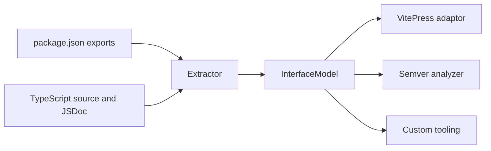

# Overview

`@kitz/paka` gives you a typed description of a package's public interface. Its job is not to build or bundle code. Its job is to answer a narrower question well: what does this package export, what do those exports look like, where do their docs come from, and how did that surface change between two revisions?

## Core abstractions

`paka` organizes the public surface into a few concrete layers:

- `InterfaceModel` / `Package`: the root model for one package.
- `Entrypoint`: one exported path from `package.json#exports`.
- `Module`: the resolved module behind an entrypoint, with docs, source location, and exported members.
- `Export`: one public symbol, tagged as either a runtime value or a type-only export.
- `SignatureModel`: a normalized shape for functions, builders, classes, and type signatures.
- `Docs` and `DocsProvenance`: structured docs content plus where that content came from.

That model is the center of the package. Everything else in `@kitz/paka` either produces it or consumes it.

## Why there are two import styles

The package publishes both `@kitz/paka` and `@kitz/paka/__`.

- `@kitz/paka` gives you a single `Paka` namespace. This is the small, wrapper-style entrypoint.
- `@kitz/paka/__` gives you the flat surface directly. This is the better fit for tooling and scripts.

On this branch, extracting `packages/paka` itself produces two entrypoints: `"."` and `"./__"`. The root entrypoint contains only the `Paka` namespace wrapper. The `./__` entrypoint contains the broader extraction, schema, markdown, adaptor, and semver surface.

## What the semver prototype adds

This branch adds a public-interface diff layer on top of extraction.

The new semver flow works like this:

1. Extract the previous package root.
2. Extract the next package root.
3. Compare entrypoints, nested namespaces, export kinds, and normalized signatures.
4. Report the highest public impact as `none`, `minor`, or `major`.
5. If you provide a current version, map that impact through the current release phase and compute the next version.

The comparison rules are structural:

- added export or added entrypoint: `minor`
- removed export or removed entrypoint: `major`
- changed export signature or changed entrypoint import shape: `major`
- no public surface change: `none`

## Boundaries

`paka` stays intentionally narrow.

- It does not infer release impact from commits, tests, or implementation details.
- It does not claim a `patch` bump from surface comparison alone.
- It does not currently publish its CLI as a package binary.
- Its built-in docs generator is VitePress-specific today.

Those constraints are a feature of the design. The model stays inspectable because `paka` only reasons about exported interface shape.
